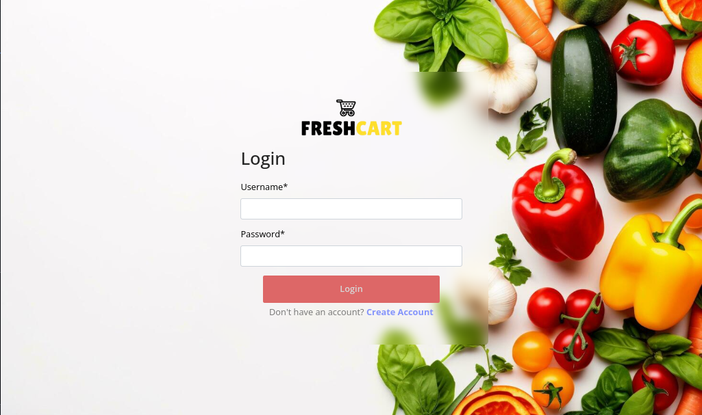
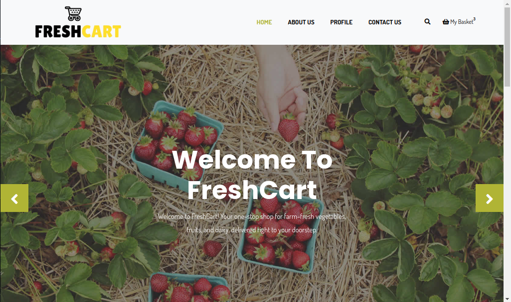
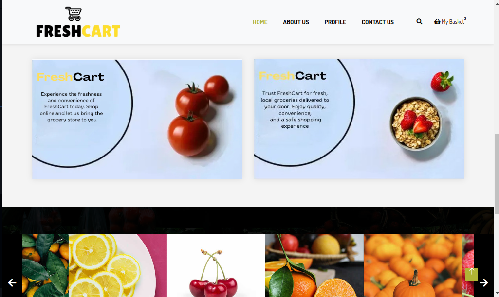
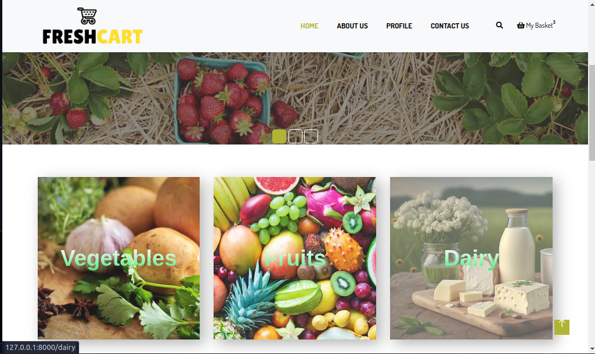
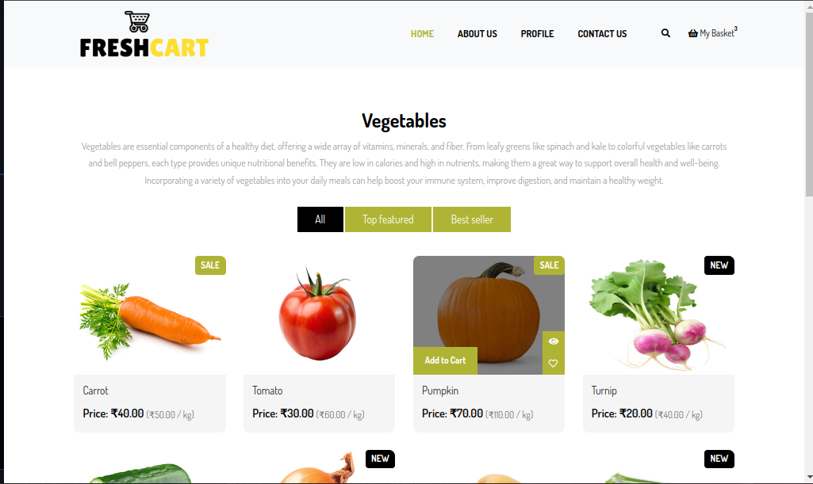
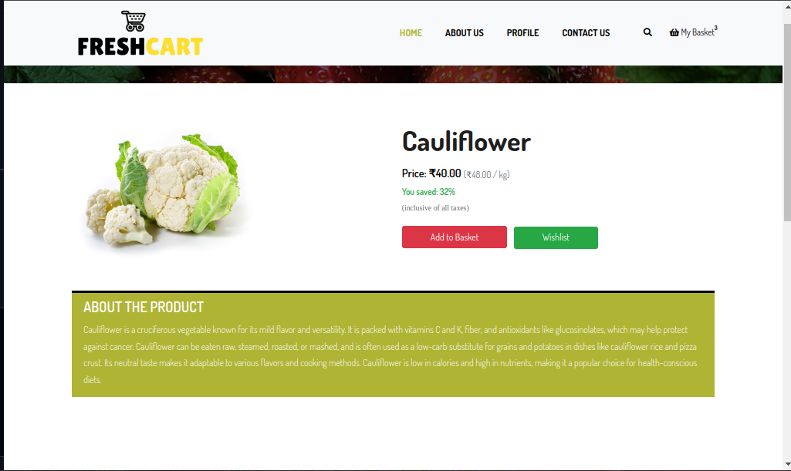

# FreshCart
FreshCart is an online grocery store platform designed to make shopping for groceries convenient and efficient. This repository contains the source code for the FreshCart website, which provides users with a seamless online shopping experience for a wide range of grocery items.

# Features
User-Friendly Interface: A clean and intuitive design that makes it easy for customers to browse and purchase products.
Comprehensive Product Range: Includes farm-fresh produce, pantry staples, dairy products, meat and seafood, beverages, snacks, and health-conscious options.
Responsive Design: Optimized for all devices, ensuring a smooth shopping experience on desktop and mobile.
Secure Payments: Integrated secure payment gateway for safe and reliable transactions.

# Screenshots

## Login



## Dashboard





## Categories



## Items



## Display Item



## Login


## Installation

1. **Clone the repository:**
Use SSH to clone the repository:
   ```bash 
    git clone github.com/zaidkhuroo/FreshCart.git
    cd CRUD_Django
   
2. **Create a virtual environment:**
   ```bash
    python3 -m venv env
    source env/bin/activate  # On Windows use `env\Scripts\activate`

3. **Install Dependencies:**
   ```bash
    pip install -r requirements.txt
   
4. **Apply migrations:**
   ```bash
    python manage.py makemigrations
    python manage.py migrate

5. **Run the development server:**
   ```bash
    python manage.py runserver

Open your web browser and go to http://127.0.0.1:8000/
